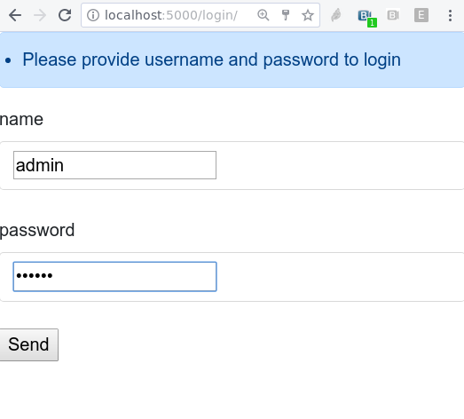

[](https://github.com/flask-extensions/Flask-SimpleLogin/actions/workflows/tests.yml)
[](https://pypi.org/project/flask_simplelogin/)
[](https://pypi.org/project/flask_simplelogin/)
[](https://pypi.org/project/flask_simplelogin/)
[](https://github.com/pallets/flask)
[](https://flask-simple-login.readthedocs.io/en/latest/?badge=latest)

# Login Extension for Flask

The simplest way to add login to flask!

## How it works

First, install it from [PyPI](https://pypi.org/project/flask_simplelogin/):

```console
$ pip install flask_simplelogin
```

Then, use it in your app:

```python
from flask import Flask
from flask_simplelogin import SimpleLogin

app = Flask(__name__)
SimpleLogin(app)
```

## **That's it!**

Now you have `/login` and `/logout` routes in your application.

The username defaults to `admin` and the password defaults to `secret` — yeah that's not clever, check the [docs](https://flask-simple-login.readthedocs.io/en/latest/?badge=latest) to see how to configure it properly!



Check the [documentation](https://flask-simple-login.readthedocs.io/en/latest/?badge=latest) for more details!
